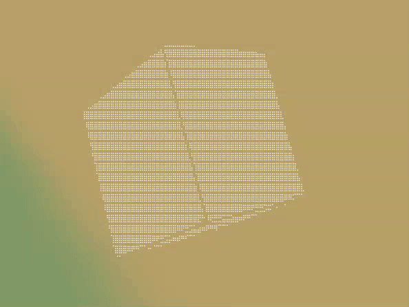

# Rotating unicode cube in c



I wanted a spinning text cube for my desktop so I wrote this program. 
For the cube to be animated, this program has to be called repeatedly.

## dependencies
 A posix based system with clang and make installed

## To run
```bash
git clone {url to this repo}
cd ccube
make clean && make
```

then

```bash
./ccube
```

or for an animated verion

```bash
while true; do text=$(./ccube); clear; echo "$text";  sleep 0.2; done;
```


